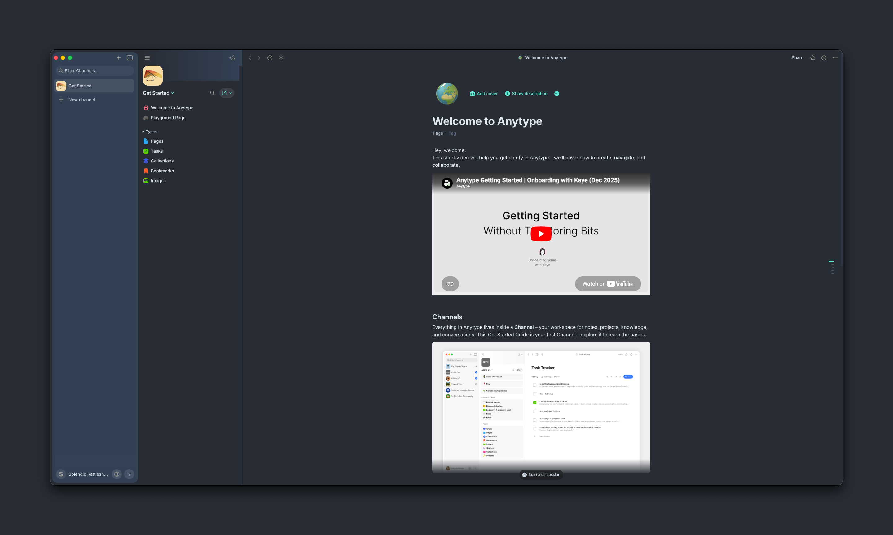

<div align="center">


<picture>
  <source media="(prefers-color-scheme: dark)" srcset="https://getslatewave.com/brand/wordmark-light.png">
  
</picture>

# Slatewave (Anytype)

A dark [Anytype](https://anytype.io) theme on a slate foundation with a teal signature. Part of the [Slatewave family](#slatewave-family) — one palette across editors, terminals, prompts, notes, and more.

> _Slate below, teal above._



</div>

---

## What it styles

Slatewave is a from-scratch theme written against Anytype's public CSS variable API — no upstream theme dependencies. It tunes:

- **Canvas** — `#282c34` editor background with a deeper `#21252b` vault sidebar, matching VSCode and Obsidian
- **Accent states** — selection, drop zones, active controls, and the system accent ramp resolve to `#5eead4` (teal-300)
- **Body text** — `#e2e8f0` slate-200 primary, `#cbd5e1` slate-300 secondary, `#64748b` slate-500 tertiary
- **Mentions and links** — internal mentions render teal, external links render sky
- **Code** — inline pill with pale-teal foreground on `#1e293b`; fenced code blocks get a soft border
- **Highlights** — the `bgColor-*` palette is retuned so yellow, orange, red, pink, purple, blue, ice, teal, lime, and green each map to a Slatewave-flavored translucent fill
- **Tags** — the `tagColor-*` palette mirrors the highlight palette with solid fills, dark text on light tags
- **Quotes** — teal left rule, italic
- **Scrollbar** — slate thumb, teal on hover

Both dark and light modes are included. Dark is the primary target.

---

## Installation

Anytype loads custom CSS from a single file in its working directory.

1. In Anytype: **Menu → File → Open → Custom CSS**. This opens (and creates if missing) `custom.css` in the Anytype work directory.
2. Replace its contents with [`custom.css`](custom.css) from this repo.
3. Back in Anytype: **Menu → File → Apply custom CSS**. Apply it twice — Anytype's first pass loads the variables, the second pass picks up rules that reference them.

> Note: Anytype custom CSS is desktop-only and per-device. It is not synced across devices. The setting can be toggled at any time.

To update later, replace the file and apply again. To uninstall, empty the file and apply.

### From a clone

```sh
git clone https://github.com/kevinlangleyjr/anytype-slatewave
cp anytype-slatewave/custom.css "$ANYTYPE_WORK_DIR/custom.css"
```

`$ANYTYPE_WORK_DIR` resolves to:

- **macOS** — `~/Library/Application Support/anytype2/`
- **Linux** — `~/.config/anytype2/`
- **Windows** — `%APPDATA%\anytype2\`

The exact subdirectory may vary by version; the **File → Open → Custom CSS** menu is the safest way to find it.

---

## Palette

Slatewave shares its palette with the companion VSCode theme and prompt. The anchor colors:

| | Hex | Tailwind | Role |
|---|---|---|---|
|  | `#282c34` | — | canvas background |
|  | `#21252b` | — | vault sidebar, raised chrome |
|  | `#1e293b` | slate-800 | code blocks, tertiary surface |
|  | `#334155` | slate-700 | borders, dividers |
|  | `#e2e8f0` | slate-200 | body text |
|  | `#5eead4` | teal-300 | **primary accent** — selection, controls, mentions |
|  | `#99f6e4` | teal-200 | hover accent, lime |
|  | `#7dd3fc` | sky-300 | ice |
|  | `#38bdf8` | sky-400 | external links, blue |
|  | `#b388ff` | — | purple |
|  | `#fb7185` | rose-400 | red |
|  | `#fbbf24` | amber-400 | yellow, warnings |

See the [VSCode theme README](https://github.com/kevinlangleyjr/vscode-slatewave#palette) for the full scale and syntax mapping.

---

## Customize

`custom.css` is a single file built around CSS custom properties. To override a variable, edit it in place — overrides at the bottom of the file win.

```css
html.themeDark {
  --color-control-accent: #34d399 !important;  /* swap teal for emerald */
}
```

Re-run **File → Apply custom CSS** after each edit.

---

## Slatewave family

One palette. Every tool.

- **Editors** — [VSCode](https://github.com/kevinlangleyjr/vscode-slatewave) · [JetBrains](https://github.com/kevinlangleyjr/jetbrains-slatewave) · [Xcode](https://github.com/kevinlangleyjr/xcode-slatewave) · [Sublime Text](https://github.com/kevinlangleyjr/sublime-text-slatewave) · [Zed](https://github.com/kevinlangleyjr/zed-slatewave) · [Neovim](https://github.com/kevinlangleyjr/neovim-slatewave) · [Helix](https://github.com/kevinlangleyjr/helix-slatewave)
- **Terminals** — [Alacritty](https://github.com/kevinlangleyjr/alacritty-slatewave) · [Ghostty](https://github.com/kevinlangleyjr/ghostty-slatewave) · [iTerm2](https://github.com/kevinlangleyjr/iterm2-slatewave) · [WezTerm](https://github.com/kevinlangleyjr/wezterm-slatewave) · [Windows Terminal](https://github.com/kevinlangleyjr/windows-terminal-slatewave) · [Kitty](https://github.com/kevinlangleyjr/kitty-slatewave)
- **Prompts** — [Oh My Posh](https://github.com/kevinlangleyjr/slatewave-omp) · [Powerlevel10k](https://github.com/kevinlangleyjr/p10k-slatewave) · [Starship](https://github.com/kevinlangleyjr/starship-slatewave)
- **Multiplexer** — [tmux](https://github.com/kevinlangleyjr/tmux-slatewave)
- **CLI** — [bat](https://github.com/kevinlangleyjr/bat-slatewave) · [delta](https://github.com/kevinlangleyjr/delta-slatewave) · [LSD](https://github.com/kevinlangleyjr/lsd-slatewave) · [btop](https://github.com/kevinlangleyjr/btop-slatewave)
- **Notes** — [Obsidian](https://github.com/kevinlangleyjr/obsidian-slatewave) · [Logseq](https://github.com/kevinlangleyjr/logseq-slatewave) · [MarkEdit](https://github.com/kevinlangleyjr/markedit-slatewave)
- **Launchers** — [Alfred](https://github.com/kevinlangleyjr/alfred-slatewave) · [Raycast](https://github.com/kevinlangleyjr/raycast-slatewave)
- **Chat** — [Slack](https://github.com/kevinlangleyjr/slack-slatewave)

See [getslatewave.com](https://getslatewave.com) for the full family.

---

## Contributing

Issues and PRs welcome. For palette changes, include a before/after screenshot of the same page so the visual tradeoff is obvious.

---

## License

WTFPL — Do What The Fuck You Want To Public License. See [LICENSE](LICENSE).
